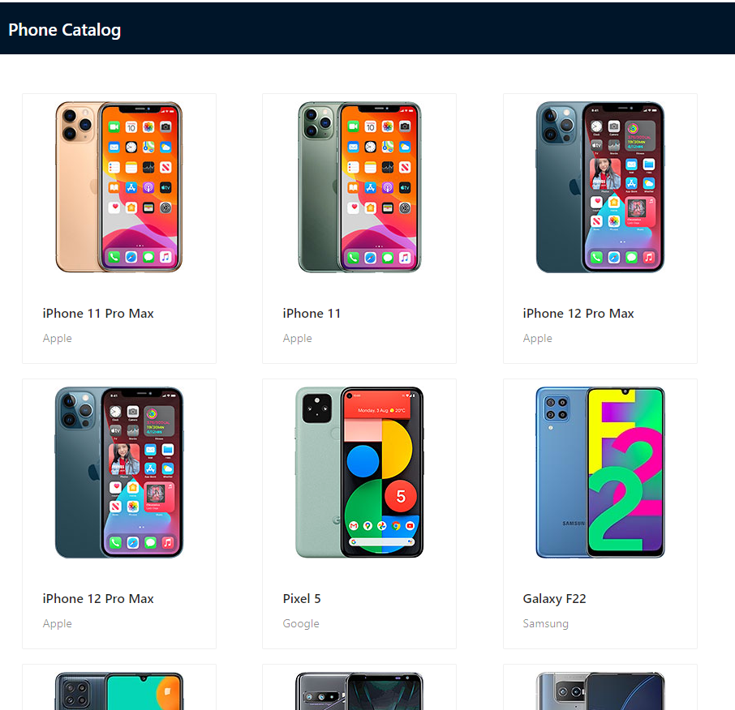

# phonebook_exam
A simple react application that uses a node server as its restful data source.



The API is written in Node and uses the Express Framework. It uses a simple json file as its database.
it exposes a list of phones via the http://localhost:3005/phones/ endpoint. 

The front-end application is written in React using NextJS.

## Getting started
After cloning this project, do not forget to 
```shell
git submodule update --init --recursive
```
after, proceed to run both services
```shell
cd ./phonebook-app
yarn install
yarn dev
```
and
```shell
cd ./phonebook-server
npm install
npm start
```
# Where to find them?
Api service will be built on - http://localhost:3005
Client service will be build on http://localhost:3000
